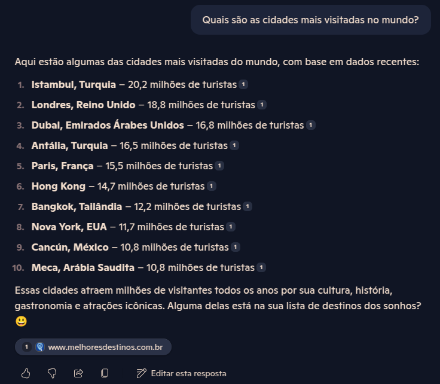
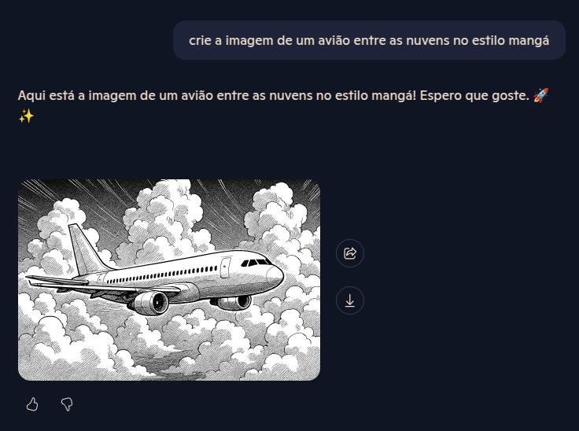
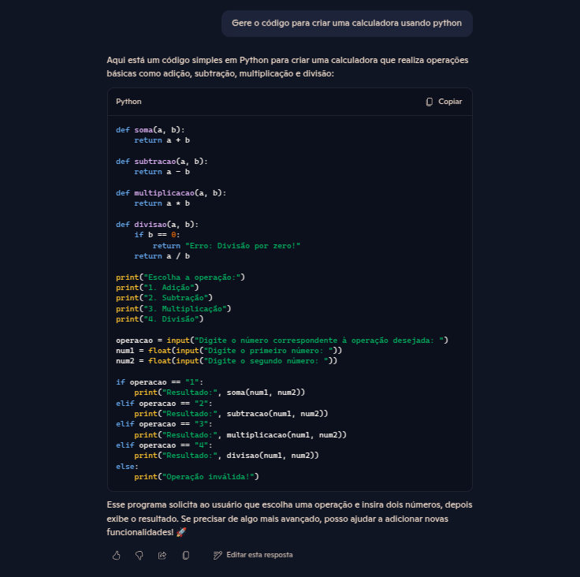

# IA Generativa com Copilot e OpenAI

## Copilot

  O Copilot é um modelo de IA Generativa desenvolvido pela Microsoft. Ele é projetado para auxiliar em uma ampla gama de tarefas, como responder perguntas, gerar textos, revisar códigos, criar imagens, entre outras capacidades.

### Funcionalidades

-Gerar respostas a perguntas:

-Gerar imagens:

-Gerar códigos de programação: 

## Azure OpenAI

  O Azure OpenAI Service permite consumir e integrar modelos de IA Generativa de grande escala da OpenAI em um ambiente de nuvem, possibilitando configurações e personalizações. No entanto, para utilizar o Azure OpenAI Service, é necessário solicitar acesso ao serviço.

## Filtros de conteúdo

  Os filtros de conteúdo do Azure AI são funcionalidades responsáveis por restringir interações com o serviço que contenham conteúdos potencialmente prejudiciais, como violência, discurso de ódio e automutilação. Além disso, é possível definir filtros personalizados para atender a necessidades específicas.
